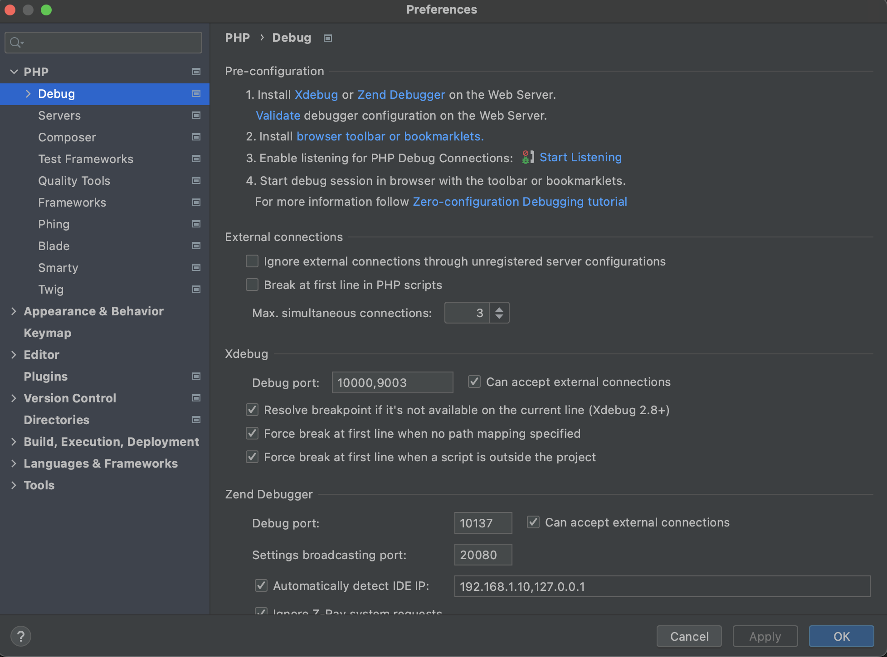
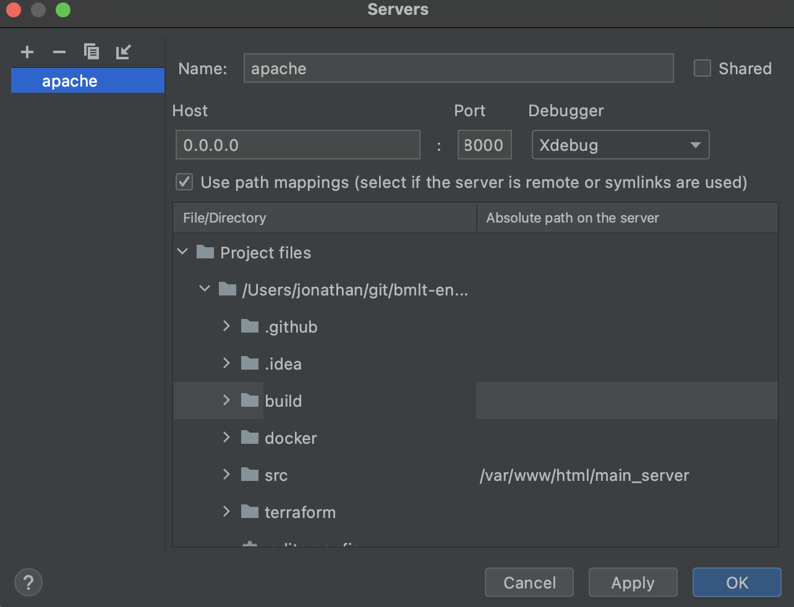
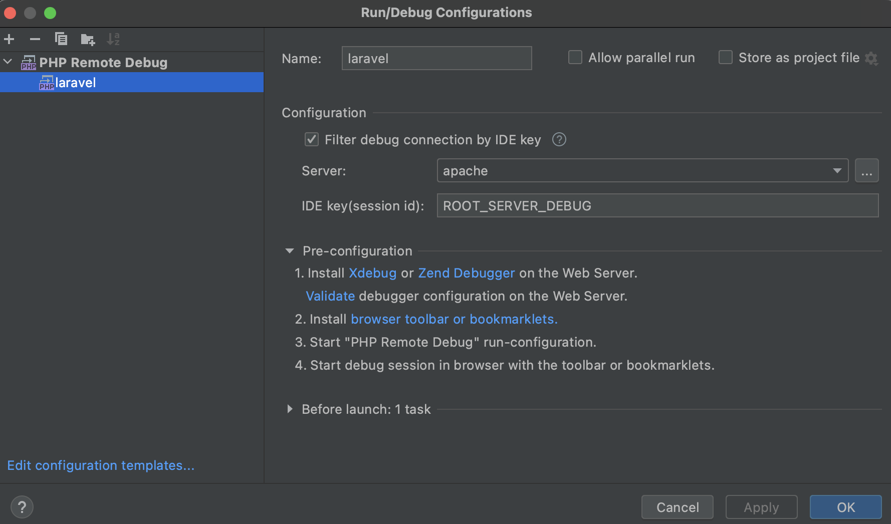
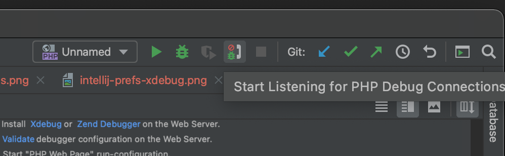
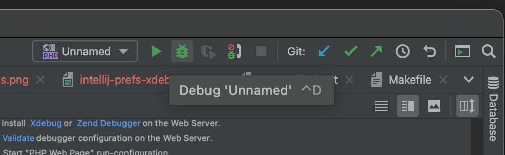

# Contributing to the BMLT Root Server

For general information about BMLT, including ways to contribute to the project, please see
[the BMLT Documentation Site](https://bmlt.app).

This file contains information specifically about how to set up a development environment to work on the root server.
We want the server code (as well as code for the other project core elements) to continue to be of high quality, so
prospective developers should have a solid grounding in good software engineering practice. In other words, making
changes to the server code wouldn't be the best place to start for folks new to software development -- there are, on
the other hand, lots of other parts of the project that could very much use your time and energy! (An exception is
that we do frequently need fluent speakers of languages other than English to translate localization strings -- even
if the initial translation has already been done, there are often new strings added in subsequent development work
that need translation.)

There are various ways you can set up your development environment; in the directions here we use
[Docker](https://www.docker.com). If you don't have it already, install
[Docker Desktop](https://www.docker.com/products/docker-desktop). Then go to the `docker` directory, which contains the
Dockerfiles for building images for both the BMLT Root Server and a MySQL database with sample data for testing
purposes. These images get pushed to `https://hub.docker.com/r/bmltenabled/bmlt-root-server/` and 
`https://hub.docker.com/r/bmltenabled/bmlt-root-server-sample-db/` respectively. They can be started together
using `docker compose`.

## How to use
1. Edit `docker/bmlt.env` to set your google maps api key, `GKEY=API_KEY`.
1. Run the command `make deps-dev` in the top-level `bmlt-root-server` directory. If you are running on a Mac and get an
error about a missing PHP extension `zip`, run `brew install php` first.
1. Run the command `make run` in the `docker` subdirectory, leaving the window open.
1. Browse to `http://localhost:8000/main_server/`.
1. Login with username "serveradmin" and password "CoreysGoryStory".
1. When finished, exit by pressing ctrl+c or by running `docker-compose down`.

You can run the linter by running `make lint` in the top-level directory.

## Supported environment variables
This is an example `bmlt.env` file. The value for each of these variables, on start of the container, is automatically
written to the appropriate line in `auto-config.inc.php`.
```
GKEY=
DBNAME=bmlt
DBUSER=bmlt_user
DBPASSWORD=bmlt_password
DBSERVER=db
DBPREFIX=na
```

## Testing the install wizard
The Docker files automatically set up an `auto-config.inc.php` file for you. Usually this is great since it saves you
the bother of going through the install wizard each time you restart the root server. However, if you want to test or
change the install wizard, you can start with the install wizard instead of the login screen by deleting this file.
Here are modified steps to do that.
1. Edit `bmlt.env` to set your google maps api key, `GKEY=API_KEY`.
1. Run the command `make deps-dev` in the top-level `bmlt-root-server` directory.
1. Run the command `make run` in the `docker` subdirectory, leaving the window open.
1. In another window, run `docker exec -it docker_bmlt_1 bash` to open a bash shell accessing the container's file system.
1. In the bash shell, `cd /var/www/html/` then `rm auto-config.inc.php`.
1. Leave the shell open so that you can check whether the installer generated a new `auto-config.inc.php` and if so what it contains.
1. Browse to `http://localhost:8000/main_server/`.
1. In the browser you will now be in the Install Wizard. Start by filling in the Database Connection Settings screen as follows.
```
Database Type: mysql
Database Host: db
Table Prefix: na2
Database Name: bmlt
Database User: bmlt_user
Database Password: bmlt_password
```
Note that the Database Host is `db` rather than the usual `localhost`. If you start with the install wizard, normally
you need an empty database, but the `bmlt` database already contains sample data. A convenient alternative to dropping
and (re) creating `bmlt` is to use the provided `bmlt` database, and to change the Table Prefix to `na2`, as above.  If you need
to run the installer again, just use a new Table Prefix each time (`na3` etc). If you do want to access mysql, run the command
`docker exec -it docker_db_1 mysql -u root -pbmlt_root_password`.

Finally, as with the earlier directions, when finished exit by pressing ctrl+c or by running `docker-compose down`.

## To debug in IntelliJ (see screenshots below for more detail)

1. Open IntelliJ Preferences. Go to `Languages & Frameworks -> PHP -> Debug`. Under the `Xdebug` section, set the `Debug port` to `10000`. Close IntelliJ Preferences. 
1. Add a new `PHP Web Page` debug configuration.
1. In the new debug configuration, make click the three dots `...` next to the Server field, and add a new Server. Set the server's `Host` to `0.0.0.0`, and set the `Port` to `8000`. Check the `Use path mappings` checkbox, and set the `Absolute path on the server` for the `Project files` to `/var/www/html`.  
1. Set the `Start URL` to `/main_server/`. 
1. To start debugging, select your new debug configuration and click the `Start Listening for PHP Debug Connections` icon. 
1. Then, click the `Debug` icon to open your web browser and start the XDebug session. 
