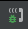
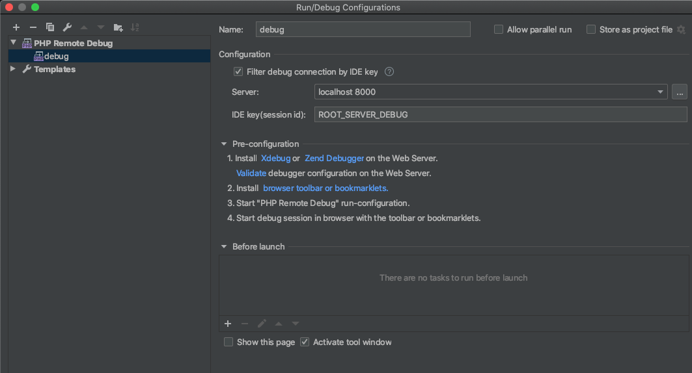
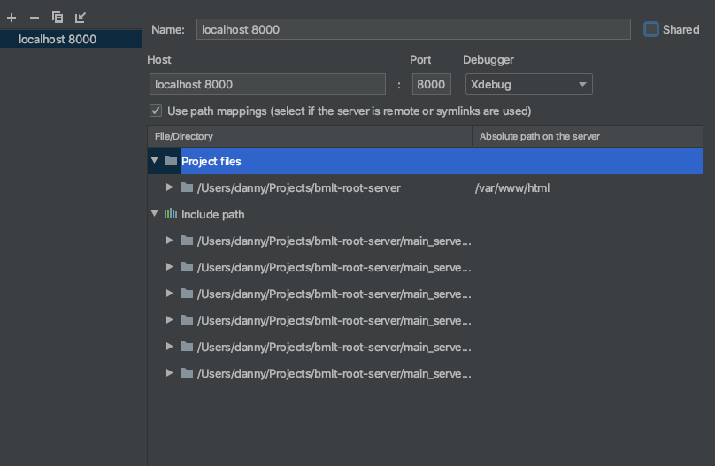

# Docker

This directory contains the Dockerfiles for building images for both the BMLT Root Server and a MySQL database with sample data for testing purposes. These images get pushed to https://hub.docker.com/r/bmltenabled/bmlt-root-server/ and https://hub.docker.com/r/bmltenabled/bmlt-root-server-sample-db/ respectively. They can be started together using docker compose.

## How to use
1. Edit bmlt.env to set your google maps api key, `GKEY=API_KEY`
2. Run the command `make run`
3. Browse to http://localhost:8000/main_server/
4. Login with username "serveradmin" and password "CoreysGoryStory"
5. When finished, exit by pressing ctrl+c or by running `docker-compose down`

## Supported environment variables
This is an example bmlt.env file. Each of this, on start of the container, is automatically written to the appropriate setting in auto-config.inc.php.
```
GKEY=
DBNAME=bmlt
DBUSER=bmlt_user
DBPASSWORD=bmlt_password
DBSERVER=db
DBPREFIX=na
```

## To debug in IntelliJ (see screenshots below for more detail)

1. Add a new configuration (ensure that you have added PHP support).
2. Select `PHP Remote Debug`
3. Add a new server, hitting the 3 dots to the right of the input box.
4. Add a server called "localhost 8000".
5. Point to hostname "localhost" and port "8000".
6. Add a path mapping for the first folder mapping to `/var/www/html`.
7. Save.
8. Set IDE key to `ROOT_SERVER_DEBUG`.
9. Save.
10. Turn on remote debugging by press the button in the toolbar. 
11. Set any breakpoints, and the code should pause there.



